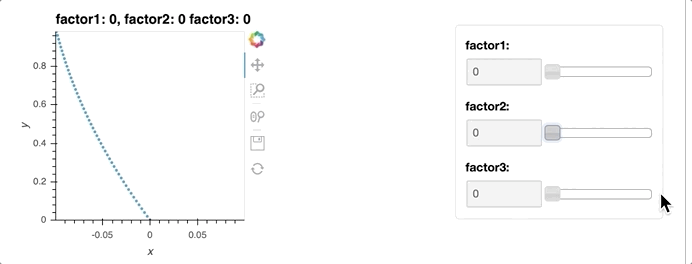

# 2D Reaching Dataset.

We used a bi-dimensional space sequential reaching dataset. Starting from point (0, 0), the point travels to goal position (-0.1, +1) or (+0.1, +1). There are ten possible trajectories to each goal; five are curved inward, and the other five are curved outward. The degree of curvature for all five trajectories is different. The number of factor combinations was thus 20 (2x2x5). The trajectory lengths were 100 and 1000.

## Label Table

|         | Degree of factors | Ground-truth factor     |
| ------- | ----------------- | ----------------------- |
| factor1 | 2                 | Goal position           |
| factor2 | 2                 | Curved inward / outward |
| factor3 | 5                 | Degree of curvature     |

## You can load dataset

- visualize_2d_reaching.ipynb

