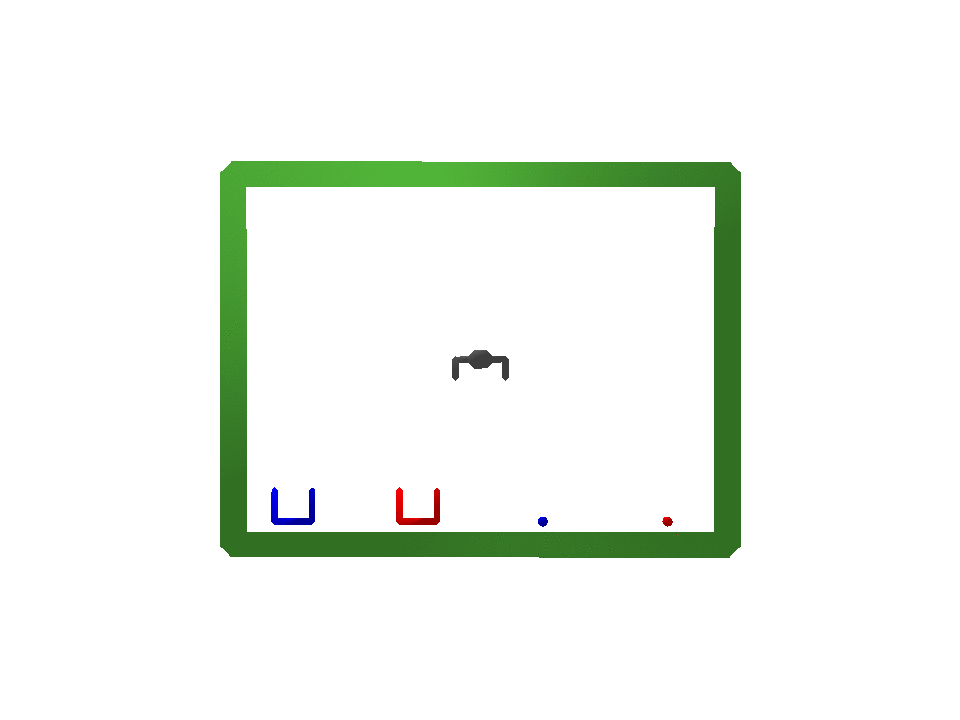
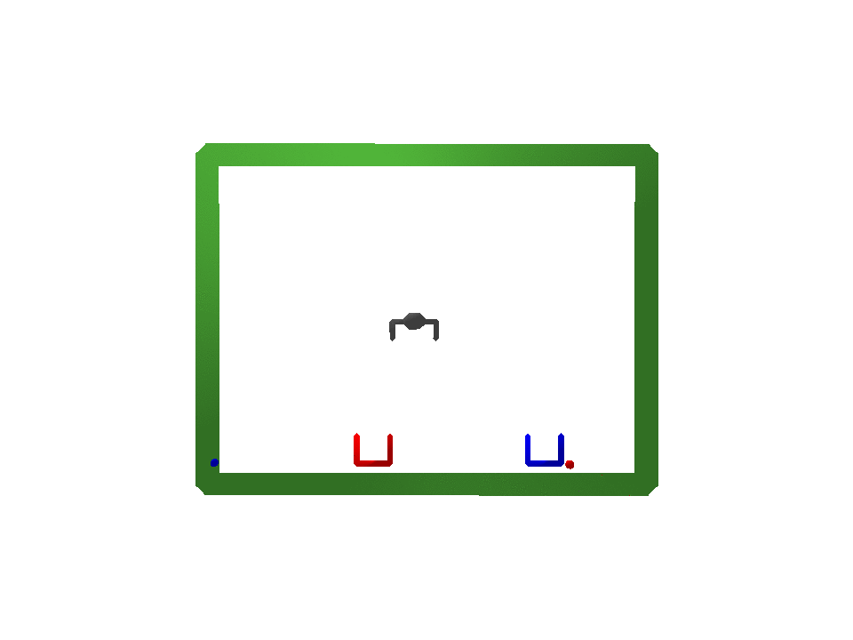
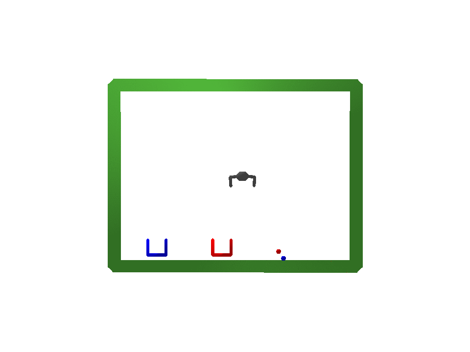
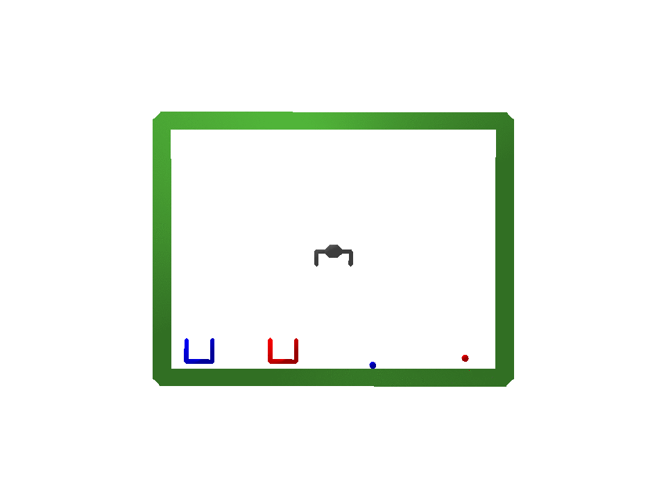

## Additional experiment (Gripper)

To evaluate the potential application of FAVAE to robotic tasks, we constructed a robot end-effector simulation environment based on Bullet Real-Time Physics Simulation [This environment is available](https://pybullet.org). The environment consisted of an end-effector, two balls (red and blue), and two baskets (red and blue) in a bi-dimensional space. The end-effector grabs one of the balls and places it into the basket with the same color as the ball. The data factors include movement "habits." For example, the end-effector could reach the targeted ball by either directly moving toward the ball obliquely or first moving above the ball then lowering itself until it reached the ball (perpendicular movement). The end-effector could drop the ball from far above the basket or place it gently into the basket. Each factor could affect different lengths among the data, e.g., "the plan to place the ball in the basket" factor affects different lengths per datum since the initial distance from the target ball to the corresponding basket may differ. This means that the time required to reach the ball should differ. Note that input is a value such as the gripper's position, not an image [details here](../gripper/README.md).

FAVAE learned the disentangled factors of the Gripper dataset. Examples visualizing latent traversals are given in the figure below. The traversed latent variable determined which factors were disentangled, such as the initial position of the blue ball and basket (b), targeted ball (red or blue) (c), and plan to place the ball into the basket (drop the ball or placing it into the basket gently) (d). These results indicate that FAVAE can learn generative factors such as disentangled latent variables for robotic tasks, eves-ladder network with 12 and 8 latent variables with beta=1000.

**(a) Reconstruction image (like as original motion)**

**(b)  Initial position of the blue ball and basket**

**(c)  Targeted ball (red or blue)**

**(d)  Drop the ball or placing it into the basket gently**

Visualization of learned disentangled representations for Gripper dataset. Traversed latent variable shows changing position of blue ball and blue basket: (b) (9th z in 1st ladder), changing target ball from red one to blue one and moving accordingly:(c) (1st z in 2nd ladder), changing plan from dropping ball to placing it gently: (d) (4th z in 2nd ladder).